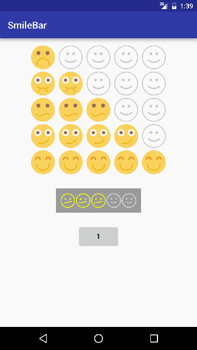

# SmileBar
[](https://android-arsenal.com/details/1/3771)

Simple android library, that provide rating view with different drawables for each rating value. This library based on [badoo's](https://github.com/badoo)  [StarBar](https://github.com/badoo/StarBar) view



## Usage
#### In your layout.xml
```xml
    <?xml version="1.0" encoding="utf-8"?>
    <LinearLayout xmlns:android="http://schemas.android.com/apk/res/android"
        xmlns:tools="http://schemas.android.com/tools"
        xmlns:app="http://schemas.android.com/apk/res-auto"
        ...
        
        <com.eugeneek.smilebar.SmileBar
            android:id="@+id/starBar"
            android:layout_width="wrap_content"
            android:layout_height="wrap_content"
            app:smileWidth="50dp"
            app:smileHeight="50dp"
            app:smileDefault="@drawable/none"
            app:smileRate1="@drawable/one"
            app:smileRate2="@drawable/two"
            app:smileRate3="@drawable/three"
            app:smileRate4="@drawable/four"
            app:smileRate5="@drawable/five"
            app:horizontalSpacing="8dp"
            app:rating="1"
            app:enabled="true"/>
        
        ...
    </LinearLayout>
```
#### In your Activity
```java
    SmileBar smileBar = (SmileBar) findViewById(R.id.starBar);
```
#### Rating change listener
```java
    smileBar.setOnRatingSliderChangeListener(new SmileBar.OnRatingSliderChangeListener() {
                @Override
                public void onPendingRating(int rating) {
                    Log.i("onPendingRating", "" + rating);
                    btn.setText("" + rating);
                }
    
                @Override
                public void onFinalRating(int rating) {
                    Log.i("onFinalRating", "" + rating);
                    btn.setText("" + rating);
                }
    
                @Override
                public void onCancelRating() {
                    Log.i("onCancelRating", "cancel");
                }
            });
```   
#### Getter and setter
```java
    smileBar.setRating(1);
    smileBar.getRating();
```    
#### Show as indicator
```xml
    app:enabled="false"
```
or
```java
    smileBar.setEnabled(false);
```
## Download
```groovy
    repositories {
        maven { url "https://jitpack.io" }
    }
    //...
    dependencies {
        //...
        compile 'com.github.eugeneek:smilebar:v1.0.0'
    }
```
## License

http://www.apache.org/licenses/LICENSE-2.0